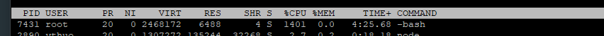

# 烦人的病毒（2020年12月30日）

昨天中午，突然收到师兄的消息，发现服务器的cpu被root用户占满，其他用户的程序都被杀掉，因为平时没有人使用root用户，并且除了我没有人知道root密码，所以当时就怀疑服务器中病毒了，于是先去root用户下查看一下历史命令，发现了一些奇怪的命令：

```bash
vim memory.limit_in_bytes
cgcreate -a vagrant -g memory:lishuai
apt install cgroup-tools
cgcreate -a vagrant -g memory:lishuai
cgcreate -a lishuai -g memory:test
……
cgcrete -a lishuai -g memory:mem-test
cgcreate -a lishuai -g memory:mem-test
cd ..
cd mem-test/
cat memory.kmem.limit_in_bytes 8589934592
echo 1 > memory.oom_control
vim memory.limit_in_bytes
cat memory.limit_in_bytes 8589934592
cat memory.limit_in_bytes
cat memory.limit_in_bytes 8589934592
echo 8589934592 > memory.limit_in_bytes
cat memory.limit_in_bytes
echo 0 > memory.swappiness
```

虽然不知道这些命令是什么意思，单可以肯定的是不是我们执行的，应该是有人黑进了服务器，然后执行了某些程序，占用cpu。

## 查找问题

一开始想的是找到他是执行的什么命令或者找到执行的那个脚本，但是使用top查看，只能看到```-bash```



于是根据pid，使用`top -Hp pid`进一步查看其中的线程信息，查到了`systemd`。

至此，**第一个卡住的点来了**。我不了解systemd是什么，于是上网Google了一下，了解到systemd是用于系统启动和管理的。这似乎对于我们查找”病毒“并没有什么帮助，但是，systemd有一个强大的日志管理工具`journalctl`，这就有希望了。

```bash
journalctl -n 20
```

查看一下最新的20条日志，其中发现了异常的日志内容：

```bash
(root) CMD (/tmp/.systemd/-bash > /dev/null 2>&1;)
```

于是找到`/tmp/.systemd/`将其删除，并kill掉`-bash`的进程，我以为就结束了，事实证明我想的太简单了。

## 问题反复

没过多久，发现cpu占用率有接近了100%，top一查，发现刚才那个命令又在执行，这基本可以确定还有一个定时检测的命令或者脚本在执行。

这是**第二个卡住的点**，该怎么找到那个定时的命令或脚本。师兄在遇到同样问题的其他同学那里了解到，可能在`/etc/cron.hourly`目录下有脚本，于是我去这个目录下查找，果然发现了一个sync的脚本文件，内容如下：

```bash
cp -f -r -- /bin/sysdrr /usr/bin/-bash 2>/dev/null
cd /usr/bin/ 2>/dev/null
./-bash -c >/dev/null
rm -rf -- -bash 2>/dev/null
```

可以看出，这个脚本将`/bin/sysdrr`拷贝到到`/usr/bin/`目录下然后再执行，所以将`/bin/sysdrr`以及sync脚本文件删除，应该就可以解决问题了。

## 删除失败

这里遇到了**第三个卡住的点**，在root用户下删除上面两个文件删除失败，显示权限不够。这就很有意思了，一直以为root用户权限“至高无上”，直接

```bash
rm -rf *
```

可以直接删除整个系统，居然还有root删除不了的。

上网去查，还真有应对的办法。首先要保证文件不是append（只可添加数据）并且是可删除的。使用[chattr](https://www.cnblogs.com/Jimmy1988/p/7265816.html)

```bash
chattr -i -a filename 
```

之后，要保证文件所在文件夹是有写权限的

```bash
chmod ugo+w 
```

最后，就可以直接删除文件了。

## 善后工作

今天来了之后，使用`journalctl`查看日志时发现满屏的脚本运行指令

```bash
12月 30 10:05:01 jiang CRON[9258]: pam_unix(cron:session): session opened for user root by (uid=0)
12月 30 10:05:01 jiang CRON[9259]: (root) CMD (/tmp/.systemd/-bash > /dev/null 2>&1;)
12月 30 10:05:01 jiang CRON[9258]: pam_unix(cron:session): session closed for user root

```

但是并没有奇怪的程序在运行，应该是定时命令没有删除干净，使用`crontab -e`命令将文件中对应的命令删除，然后保存就好了。

## 未解之谜

最重要的一个事情没有解决，那就是这个程序最初是怎么被放进来的……
